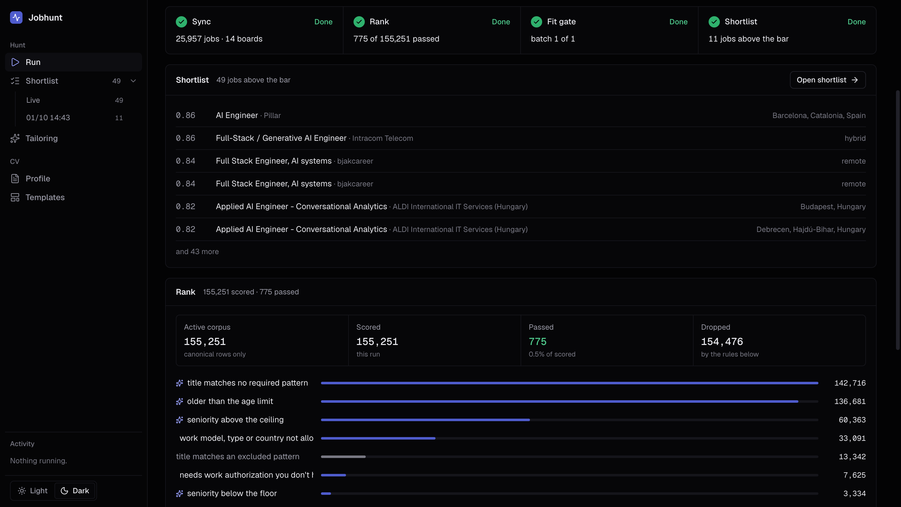
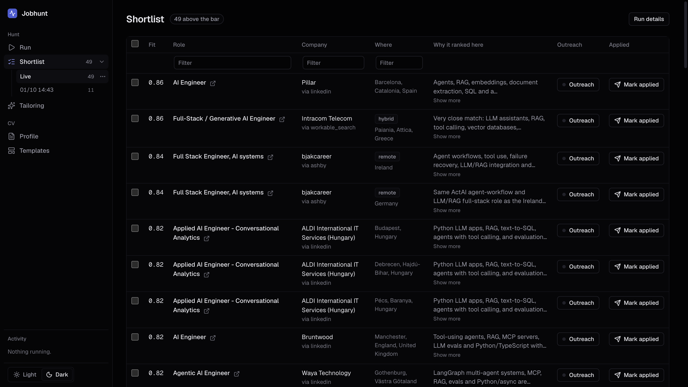
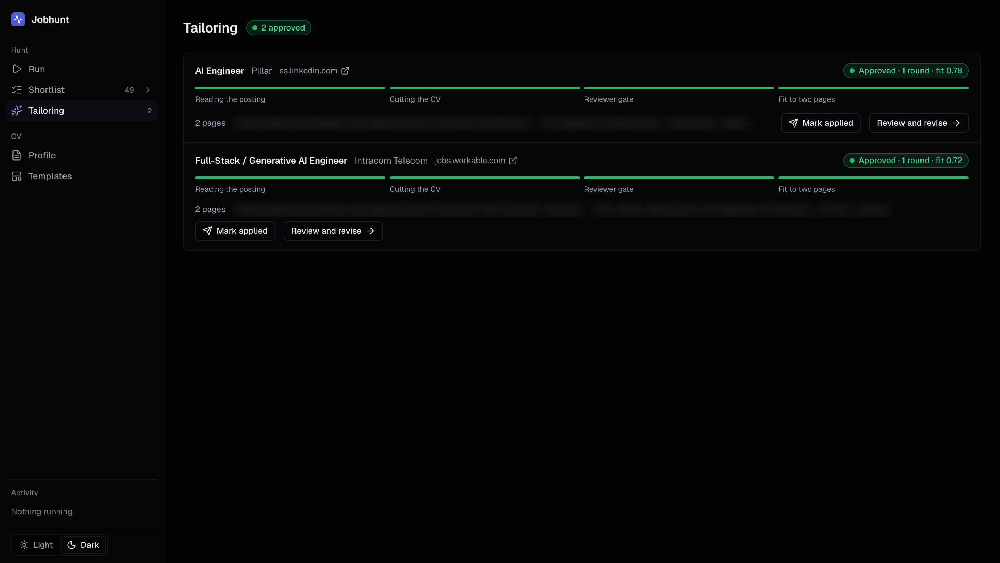
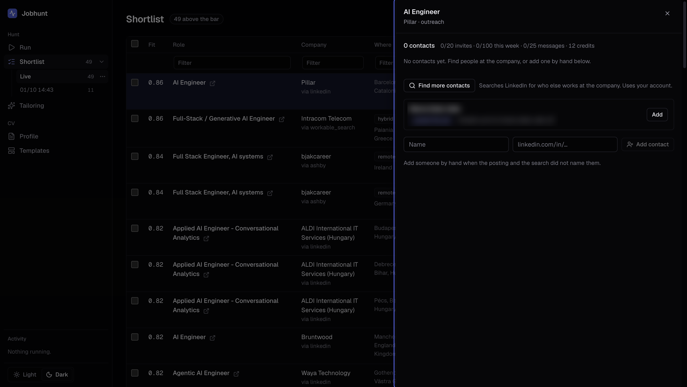

# jobhunt

A local job search that runs on your own machine: it finds openings across
thousands of company job boards and LinkedIn, ranks them against what you are
looking for, scores the survivors with Claude, and tailors a CV for the ones you
pick. It never applies for you. Full architecture in `PLAN.md`.

**You never type a company name.** The board list is discovered, not curated.

## The web app

`jobhunt serve` opens it on `127.0.0.1:8765`. It binds to loopback only, so
nothing outside your machine can reach it.

### Run



One button runs the whole pipeline, with each step's progress live on screen:

1. **Sync.** Every source is fetched at once, one thread each, and each is
   stored as soon as its own fetch finishes. A run fetches every *relevant*
   board: one that has ever posted a title you are looking for, plus the
   aggregator feeds. **Check other boards** fetches the rest on demand, and any
   board that turns out to carry a matching job becomes relevant from then on.
2. **Rank.** Your filters, free and deterministic, over the whole corpus. The
   page shows how many jobs passed and what dropped the rest.
3. **Fit gate.** Claude scores every job that passed, twenty at a time, until
   none is left unscored. It runs through the `claude` CLI, so there is no API
   key.
4. **Shortlist.** Before a job is shown, its posting is checked to be still
   open; a closed one never reaches the list.

Pause keeps what a run already fetched; Stop ends it. Filters (titles,
locations, seniority, salary, work authorization and the rest) are set on the
same page.

### Shortlist



Every job above the bar, with its fit score, where it came from, and the
gate's one-line reason. Earlier runs stay in the sidebar. From here you pick
jobs to tailor, open outreach, or mark a job applied.

### Tailoring



Each selected job gets its own folder and a CV cut from your profile for that
posting. A reviewer with fresh context gates every CV: a claim that does not
trace back to your master CV fails it, and the loop goes up to three rounds
before it reports a failure rather than shipping one. **Review and revise**
opens the CV next to its findings.

### Outreach



Find who posted a job, or who else works at the company, and draft a LinkedIn
message to them. It goes through [Unipile](https://www.unipile.com) with your
own account, under daily and weekly caps set below what a person does by hand.
Set `UNIPILE_DSN`, `UNIPILE_API_KEY` and `UNIPILE_ACCOUNT_ID` to enable it.

### Profile and templates

Your CV lives as data on the Profile page and renders through a LaTeX template
from the Templates page. See [Your CV](#your-cv).

## Install

```bash
python3 -m venv .venv
.venv/bin/pip install -e ".[dev]"
.venv/bin/jobhunt init
```

`init` writes `~/.jobhunt/config.yaml` and runs the alembic migrations against
`~/.jobhunt/jobhunt.db`. The boards table starts empty.

The web app needs its interface built once, and two tools on the path:

```bash
cd ui && npm install && npm run build   # into jobhunt/web/static
claude auth login                       # the fit gate and tailoring run through it
jobhunt serve
```

A TeX distribution with `lualatex` (TeX Live is what is tested) builds the CVs.
For working on the interface, `scripts/dev.sh` starts the API and a Vite dev
server on `localhost:5173` in the background; `scripts/dev-stop.sh` stops both.

Point everything at a scratch directory with `JOBHUNT_HOME=/tmp/whatever`.

## Commands

```bash
jobhunt init                          # config and database
jobhunt discover --strategy yc          # seed boards from a public company list
jobhunt discover --strategy commoncrawl # bulk backfill from the crawl index
jobhunt discover --strategy feeds       # register the tier 2 aggregators
jobhunt discover --strategy harvest     # mine ATS tokens out of ingested URLs
jobhunt discover --domain acme.com    # probe one company I actually care about
jobhunt boards --list --status validated
jobhunt boards --validate             # one fetch per candidate
jobhunt sync                          # every source
jobhunt sync --source ashby           # one source
jobhunt sync --source ashby --force   # ignore next_fetch_at
jobhunt sync --source ashby --dry-run # fetch and normalize, write nothing
jobhunt sync --source ashby --from-raw 20260820T000513   # re-normalize, no network
jobhunt boards                        # counts by provider, status, tier
jobhunt sources                       # per-source health
jobhunt rank                          # stage 1, deterministic, free
jobhunt rank --emit batch.json        # stage 2 batch for the gate
jobhunt rank --ingest verdicts.json   # write the gate's scores back
jobhunt review                        # interactive triage
jobhunt review --format=digest        # cron-safe plain text
jobhunt jd <job_id>                   # run the extraction ladder
jobhunt jd <job_id> --paste           # paste the JD yourself
jobhunt apply <job_id>                # record it and hand off to tailoring
jobhunt skip <job_id> --reason "..."
jobhunt status <job_id> screening
jobhunt list --source greenhouse --limit 20
jobhunt show <job_id>
jobhunt stats
jobhunt serve                         # the web app, on 127.0.0.1:8765
```

## The automated flow from Claude Code

Without the web app, `/scrape-jobs` (`~/.claude/skills/scrape-jobs/SKILL.md`)
orchestrates the CLI from Claude Code. From Claude Code it is one command:

```
/jobhunt-config     set what you are looking for, conversationally
/scrape-jobs        sync every board, rank, show the top matches, update the CSV
```

The skill orchestrates the CLI and contributes the
one thing it cannot do without an API key: scoring the fit gate.

1. `jobhunt sync --fast` in the foreground, capped at 12 boards per source, which
   measures at 2m17s on a 10000 board corpus. The full sweep runs in the
   background; an advisory lock keeps the two off the same boards.
2. `jobhunt rank`, then `rank --emit`, scored inline, then `rank --ingest`.
3. `jobhunt shortlist --export` prints the table and upserts the CSV.
4. Checkboxes. Then per selected job: `jobhunt apply <id> --no-tailor`, a
   tailoring agent in unattended mode, and `cv-jd-reviewer` with fresh context
   gating it. Up to 3 rounds, then it reports a failure rather than shipping.
5. `jobhunt csv mark-applied <ids> --cv-status cv_ready`.

The reviewer checks two things and only one of them is a gate. **Fabrication is
a hard fail:** every claim in the CV must trace to a line in the master it was
cut from. That
replaces the skill's own approval step, which exists for exactly this, and it is
a stronger check than a human skimming a diff, because a reworded overclaim uses
only words that are already in the master and passes the token verifier. Fit is
a score, and a CV that honestly cannot match a posting any better is approved
with a stated gap rather than looped until it invents something.

## The CSV

`~/.jobhunt/jobs.csv`, keyed by job id, one rolling file.

```
job_id,fit,title,company,location,work_model,employment_type,salary,url,
source,applied,cv_status,first_seen,last_seen
```

An export refreshes scores and metadata and **never** touches `applied` or
`cv_status`. That is what makes the file safe to regenerate on every run, and
those two columns are the only thing in it nothing else can reconstruct. Writes
are atomic. A job you applied to stays in the file even after it drops off the
shortlist.

## Settings

```bash
jobhunt config show
jobhunt config set titles="backend,AI,platform" work_model=remote,hybrid     locations="Europe,remote worldwide" experience=senior job_types=full_time     min_salary=80k currency=USD top_n=15
```

Python owns the YAML. The wizard only collects answers, because a model
hand-writing `filters.yaml` is how one bad indent silently drops every job. The
writer owns a delimited block; anything you tune by hand elsewhere survives.

One thing to watch: `titles` **replaces** the shipped engineering patterns rather
than adding to them. `config set` prints how many active jobs the new list
matches, because a job the title rule misses is never seen, never ranked, and
never appears in the table.

## Daily use

```bash
jobhunt sync                              # cron: fetch what is due
jobhunt rank                              # cron: stage 1, free
jobhunt review --format=digest > today.txt

jobhunt rank --emit ~/.jobhunt/data/rank/batch.json   # when you want the gate
# score that file in Claude Code, save the verdicts
jobhunt rank --ingest verdicts.json
jobhunt review                            # triage what survived
```

`sync` and `rank` are safe in cron. The gate is not, and that is deliberate:
there is no API key here, so stage 2 runs through Claude Code over a file. That
also makes every gate run inspectable and replayable after the fact.

## Ranking

**Stage 1** is `filters.yaml`, free, and runs on everything. On a 16222 job
corpus it took 20 seconds and left 689 survivors. The rules that do the work:

| Rule | What it removes |
|---|---|
| `max_age_days` | 10257 postings older than 30 days |
| `timezone.min_overlap_hours` | 7101 jobs whose working day does not overlap Istanbul |
| `hard_requires.remote_type` | 2711 on-site roles |
| `require_titles_regex` | doctors, translators, estimators, assistants |
| `exclude_titles_regex` | 1601 sales and recruiting roles |
| `seniority_min` | 1049 junior and intern postings |

One rule governs all of them: **an unknown value is never a rejection.** A
missing country, seniority, or date means "no objection", because aggregators
drop fields that a company's own board states fully. A job wrongly kept costs
one gate call. A job wrongly dropped is never seen.

**Stage 2** is the LLM gate, over a file. `rank --emit` writes the survivors,
the market's prompt, and a candidate summary derived from `master.tex` with
contact details stripped. `rank --ingest` writes the verdicts back, rejecting
any score outside 0..1 or any job id not in the corpus.

## JD extraction

The real output of this tool is clean, complete JD text, because that is what
the tailoring skill takes as input. The ladder runs rungs 1 (JSON-LD), 2
(readability), and 5 (manual paste); rungs 3 and 4 arrive with the Turkish
sources in phase 7.

Extraction is lazy on purpose: never at sync time, sometimes at rank time,
always before apply. Detail HTML is cached under `data/raw/detail/` before
anything parses it, so fixing an extractor costs no request.

The quality gate sits **between** the rungs, and that is the whole point. A
JSON-LD block containing a two-line SEO stub fails it, and the ladder falls
through to readability rather than calling the stub a JD.

## Applying

`jobhunt apply` records that **you** applied. It never submits anything to an
employer, and there is no code path that could.

It refuses in three cases: a JD that is not full after the ladder runs, a
quality score under 0.5, and a folder that already holds other files. A CV
tailored against a truncated JD is worse than no CV, because it looks finished.

The folder is `<Company> - <Position>` under `applications_root`, and the JD is
`jd.txt`, because that is what the tailoring-cv skill's own scripts expect.
PLAN.md section 10 proposed different names; the skill wins. `job.json` is
written alongside as a sidecar the skill does not read yet.

Acting on any row of a duplicate cluster covers the whole cluster, so a job
applied to through Ashby does not resurface from Himalayas tomorrow.

Every command prints one line or one table. Payloads go to disk, never to stdout.

## Your CV

The CV is data, not LaTeX. The Profile page in `jobhunt serve` edits
`profile.json` next to `master.tex` in `CV_Source`: one form per section, with
bullets, hidden items and notes. **Generate** renders it through a template into
`master.tex` and `Master_CV.pdf`, and those files are only ever replaced by a
generate that compiled. A `master.tex` you already have is imported once, by an
agent, and the page shows every word it would lose before you accept it.

Templates live on the Templates page. Two ship with the app, Classic and Modern.
You can upload your own `.tex`: a finished CV is converted by an agent that
rewrites only the body and keeps the preamble, which holds the look, byte for
byte. Nothing is added until it compiles with your details, hides what you hid,
and prints everything else. Changing the default template empties the master CV
until you generate again, because a PDF in the old template is not the master any
more.

Tailoring picks a template per job. Each application folder gets its own
`master.tex`, rendered from the profile in that job's template, and the tailoring
agent, the verifier, the reviewer and the revise studio all read that copy. With
no profile saved, tailoring cuts from the global `master.tex` as it always did.

**Uploaded templates are not trusted.** An upload is filled in a child process
with a time limit and built under macOS `sandbox-exec`, with no network and no
access to your home folder. Every tailored CV is built the same way, whatever its
template: its preamble may be an upload's, and its body was written by an agent
that read a posting from the internet. The tailoring agent compiles through
`python -m jobhunt.cv.tailored`, is refused TeX engines in its own shell, and a
CV only ships when the PDF named for sending is that command's build of the
final `cv.tex`. Each sandboxed build gets a throwaway copy of TeX's font cache,
so nothing one build writes is seen by the next.

## How a sync works

Two passes over separate storage, which is the point.

1. **Fetch.** Every relevant board of the source (see below). Each response is
   written verbatim to `~/.jobhunt/data/raw/{source}/{run_key}/{provider}__{token}.json`
   in an envelope carrying the token, market, and fetch time.
2. **Normalize.** Each stored envelope is parsed into `JobPosting` records and
   upserted. `--from-raw <run_key>` replays this pass alone, so a parser bug costs
   a re-parse and never a re-fetch.

Then deduplication runs, boards get their tier and `next_fetch_at` updated, and a
`runs` row records the outcome.

A board that errors does not fail the run: the source is marked `degraded`, the
error is recorded, and the other boards still land. Three consecutive errors and
the board is marked `dead` and never fetched again.

## Discovery: where boards come from

`PLAN.md` 3.5 lists five strategies. Two are built, and the measured yield
decided the order.

**Strategy B plus E, the cold start.** `discover --strategy yc` pulls the
`yc-oss` hiring list (1488 companies), derives a token from each company website
(`inkeep.com` -> `inkeep`), and writes one candidate board per provider. It never
fetches a board itself. The ordinary sync validation loop proves each candidate
with a single request: jobs found means `validated`, a valid empty response means
`empty`, an error means `dead` on the spot.

From an empty database, 40 companies produced 120 candidates, of which 21
validated into live boards carrying 1267 jobs. Nothing was named by hand.

**Strategy A, apply-URL harvesting.** `discover --strategy harvest` runs the
regex bank in `jobhunt/discovery/patterns.py` over every `apply_url`,
`source_url`, and description body in the corpus. It is incremental: a watermark
in the `meta` table means only new rows are scanned, and `--full` rescans after a
pattern change.

Only a structured field can attribute a board to a job's company. A link inside a
description body is as likely to be a "see also" for a different company, and a
wrong `company_id` is worse than none.

**A measured caveat.** `PLAN.md` expects Strategy A to cold-start the corpus off
Himalayas. It cannot. Measured across six aggregators, 463 job records produced
one ATS token, because every aggregator wraps its apply link in its own domain.
The write-up is in `references/sources.md`. Strategy A still earns its place: ATS
postings do leak their own tokens.

**Strategy C, the Common Crawl backfill.** `discover --strategy commoncrawl`
queries the CDX index once per provider and turns the returned URLs into
candidates. Live: 4 providers, 4 requests, 23 seconds, 32491 records, **4106 new
candidate boards**. Subdomain wildcards (`*.recruitee.com`) work natively, which
is what covers the subdomain-keyed providers. Validating the first 200 recruitee
candidates resolved 182 live boards and 3056 jobs, a 91 percent hit rate: these
tokens beat domain guesses because they were real URLs.

Run it at setup and maybe quarterly. It is a backfill, not a daily job, and
Common Crawl asks not to be overloaded.

**Strategy D, certificate transparency, is deliberately not built.** Measured:
crt.sh returns only the provider's own infrastructure subdomains, because
customer boards sit behind a wildcard certificate that names nobody. A board
confirmed live in phase 3 does not appear in its own provider's CT results. The
Common Crawl subdomain patterns cover the same providers properly.

**Which boards a run fetches.** Discovery produces thousands of tokens, and
most belong to companies that never hire for what you are looking for. A run
fetches every **relevant** board, every time: one that has ever posted a job
whose title matches your title patterns, plus the aggregator feeds. Relevance is
worked out from the stored jobs against the current patterns, so changing your
titles changes the set at once.

Everything else (boards whose jobs never matched, empty boards, unvalidated
candidates, and once, dead boards) is fetched only by **Check other boards** in
the web app. A board that turns out to carry a matching job is relevant from
then on. In practice the first check took a corpus from 892 relevant boards to
2,030.

A board that answers 429 is waited out (its `Retry-After`, or 30 seconds
doubling) and asked again, never counted as failing. A 429 that only arrives
after a redirect to another site, which is how Personio answers for a company
that has left it, counts as the board being gone.

## Sources

| Provider | Endpoint style | JD in the list response |
|---|---|---|
| greenhouse | JSON, token in path | yes, HTML-escaped on the wire |
| ashby | JSON, token in path | yes |
| lever | bare JSON array | yes, split across four fields |
| recruitee | JSON, token in subdomain | yes, split across two fields |
| smartrecruiters | JSON, paged | **no**, detail fetched lazily in phase 5 |
| personio | XML | yes |
| workable | JSON widget API | yes |

Two sources search by title and location instead of fetching a company's board,
so they find jobs at companies the board list has never heard of:

| Source | How | Limits |
|---|---|---|
| linkedin | public job search pages, then each new job's own page | about 10 requests a minute from one IP, measured; a 429 is waited out |
| workable_search | `jobs.workable.com` cross-company search | 5 pages of 20 per search; descriptions included |

LinkedIn only opens the page of a job whose title passes your title rules,
which halved its requests. Workable search results carry no board token, so
those jobs merge with board copies through deduplication rather than by key.

Workday is deferred: see `references/sources.md` for why.

Workable took three phases to resolve. Every guessed account token answered 200
with an empty jobs array, which is indistinguishable from a working endpoint
with nothing to say. Real tokens from the Common Crawl backfill settled it.

Tier 2 aggregators, registered as feed boards by `discover --strategy feeds` and
re-fetched daily rather than weekly:

| Feed | Records per run | Notes |
|---|---|---|
| remotive | 17 | `limit` is not honoured; salary is free text |
| remoteok | 100 | first array element is a legal notice, not a job |
| arbeitnow | 650 | paged; descriptions are HTML-escaped on the wire |
| jobicy | 50 | best-shaped: structured salary fields |
| wwr | 162 | RSS; title packs "Company: Position" |

None of them leak ATS tokens, so they add jobs, not boards.

## Deduplication

Two layers, per `PLAN.md` section 5.

**Layer 1** is `(source, external_id)`, a unique constraint. A posting already
seen from the same source refreshes its row and bumps `last_seen_at`.

**Layer 2** clusters across sources. Records group by company plus normalized
title, then four checks decide whether two rows are one job:

| Check | Rule |
|---|---|
| country | two known, different countries never merge |
| city | different cities never merge; "New York" and "New York City" do |
| seniority | different known levels never merge |
| description | simhash Hamming distance within 12 over 2-word shingles |

Every check treats an unknown value as "no objection", because aggregators drop
fields the company's own board states fully. Splitting on a missing field is the
failure clustering exists to prevent.

Nothing is deleted. Every source row is kept and `canonical_job_id` points at the
earliest-seen member, so `review` can show a single card with an "also on" line.

## Development

```bash
.venv/bin/pytest tests -q      # no network
.venv/bin/ruff check jobhunt tests scripts
```

Tests never hit the network. Adapter fixtures in `tests/fixtures/` are real
responses captured from the live endpoints, trimmed to five jobs each.

To re-verify endpoints:

```bash
python3 scripts/probe_sources.py            # all 20 endpoints
python3 scripts/probe_sources.py --only ashby
python3 scripts/probe_discovery_yield.py    # how many tokens each aggregator leaks
```

Results land in `data/probe/*.json` and the findings are written up in
`references/sources.md`.

## Schema migrations

```bash
.venv/bin/alembic revision --autogenerate -m "what changed"
.venv/bin/alembic upgrade head
.venv/bin/alembic check
```

The database URL comes from the jobhunt config, never from `alembic.ini`.

## Cold start

```bash
jobhunt init
jobhunt discover --strategy feeds           # 7 aggregator feeds
jobhunt discover --strategy commoncrawl     # thousands of candidate boards
jobhunt discover --strategy yc              # the YC market
jobhunt sync                                # validates candidates as it goes
jobhunt discover --strategy harvest         # mine the URLs that just landed
jobhunt boards --list --status validated
```

`jobhunt boards --validate` proves candidates from the command line; in the web
app, **Check other boards** fetches every candidate once.

State of a scratch corpus built this way, from empty, in one session:

```
jobs=17064 active=17064 canonical=16222 clustered_away=842
companies=2389 boards=10142 full_jd=17013
```

Validation hit rates on Common Crawl tokens, measured: recruitee 182/200,
greenhouse 138/200, ashby 34/50, workable 49/50.

No company name appears anywhere in that sequence, which is the requirement the
whole discovery layer exists to satisfy.
